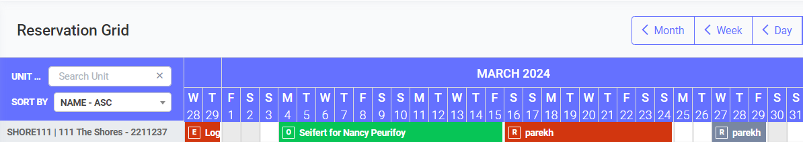
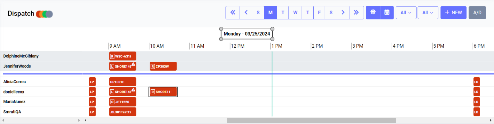
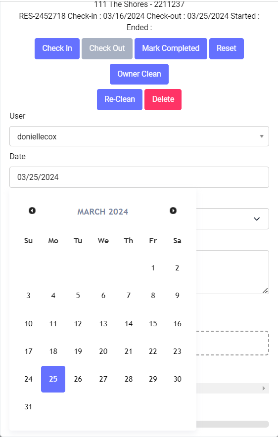

# Dispatch system from reservation
<procedure title="What is Housekeeping" collapsible="true">
    <step>Housekeeping refers to the management and maintenance of a living or working space to ensure cleanliness, orderliness, and functionality. 
          It involves a variety of tasks such as cleaning, organizing, tidying, and maintaining the overall condition of a space. 
          Housekeeping encompasses both routine chores like sweeping, dusting, and laundry as well as more specialized tasks like Check Out Clean,Deep Clean,Initial Clean and Re-Clean . Effective housekeeping not only promotes hygiene and safety but also contributes to creating a comfortable and pleasant
          environment for occupants or visitors. In commercial settings, housekeeping may also extend to the maintenance of public areas, facilities, and equipment to uphold
          cleanliness standards and enhance the overall experience of customers or users.</step>
</procedure>

<tip>
    

          Reservation to housekeeping system work-flow
    

</tip> 
<code-block lang="mermaid">
graph LR
   A[Reservation Grid]
   A -- To  --> B[Housekeeping View]

</code-block>

<note>
    

       prerequisite
    

</note>
A reservation is created with below mention details 

{type="narrow" sorted="desc"}

Date 
: 16/03/2024 to 24/03/2024

Unit name 
: SHORE111

<chapter title="Housekeeping work-flow  " id="example-chapter-id">

<procedure title="Housekeeping tasks are scheduled for March 25th." collapsible="true">

<tip>
    

    Housekeeping details will appear on the screen the day after checkout. 
    

</tip> 
</procedure>

<procedure title="User modifies the housekeeping schedule." collapsible="true">

<tip>
    

        The dispatch system should update the housekeeping tasks to March 26th (new checkout day)
    

</tip> 
</procedure>

</chapter>